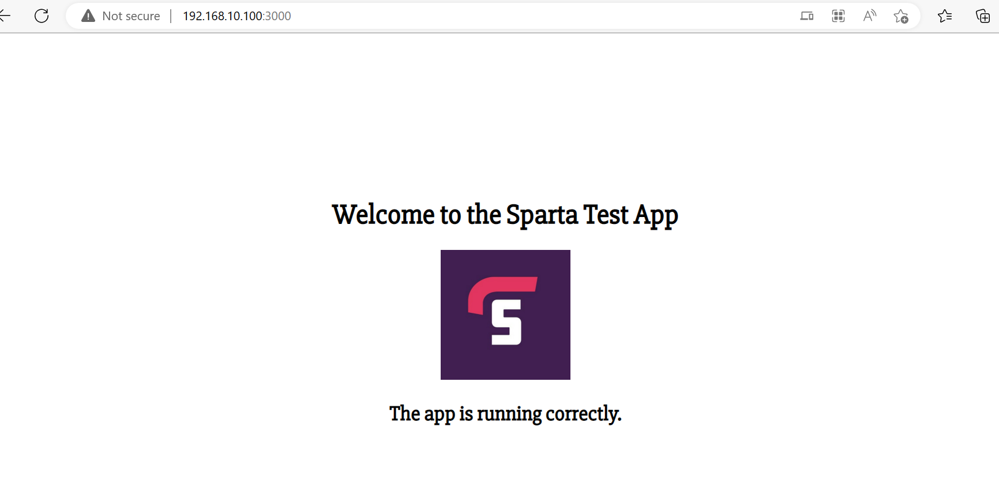

# DevOps and Development Environments

## DevOps - Notes

### What is DevOps?
Key aspects of DevOps include breaking the silos that keep Developer and Operations teams apart in order
to improve collaboration, share responsibilities, deploy infastructure as code, continuous integration and continuous delivery, microservices, monitoring and logging.

benefits include:
- improved collaboration
- faster, better product delivery
- more stable operating environments
- greater automation
- greater innovation


### What we want our tools to be
- Easy to use - other teams use the tools we create, they won't do so if they aren't user firendly
- Flexible - everything the company uses should be easily updated as the business need changes
- Robust - need close to 100% uptime as possible for our company's services
- Cost - cost is often overlooked, we need to ensure the company is being as efficient as possible in its tech dealings

#### Why its important
- Ease of use - if devs don't use our tools, there will be headache/delays later down the line
- Flexibility - it can be easy to get locked into using a specific product, tool or software and it then becomes hard for a company to keep with industry changes
- Robustness - We are responsible for achieving this as DevOps Engineers
- Cost - e.g. How powerful a machine do we need to conduct a task? Do we need certain servers running? etc.

### Infastructure and Architecture
#### Monolith
A monolithic architecture is a traditional model of a software program, which is built as a unified unit that is self-contained and independent from other applications.
#### Two tier 
In a two-tier architecture, the client is on the first tier. The database server and web appliction server reside on the same server machine which is the second tier
#### Microservices
A microservice architecture – a variant of the service-oriented architecture structural style – is an architectural pattern that arranges an application as a collection of loosely coupled, fine-grained services, communicating through lightweight protocols.

### Risk Assessment
The 5 principles of risk assessment is
1. Identify hazards
2. Assess the risks
3. Control the risks
4. Record your findings
5. Review the controls


## Development Environments
### What are Dev Environments?
A space that Developers use to write, run and test their codes. These spaces usually have programs and tools configured according to their needs.
### Why are DevOps Engineers developing these environments?
One of the main reasons we need to build these is to ensure consistency accross all environments as opposed to having developers write code in one environment with different tools that may result in issues later on in deployment.
### What makes a Good Dev Environment?
- User firendly, fast and robust
- Flexible (from our perspective - not the devs)
- It should match the production environment as closely as possible
- It should be the same for everyone everywhere
- It should only support one application:
  - App 1 requires version 1.1, App 2 requires version 1.4
  - App 1 needs a specific program that conflicts with the program needed by App 2

### Setting up our Environment using Vagrant
After installing VirtualBox and Vagrant we will start using Vagrant. In GitBash, while in the right folder, we enter
```
vagrant init ubuntu/xenial64
```
`init` simply meaning 'initialise', and `ubuntu/xenial64` being the OS we want our virtual machine to be.
Follwing which we should get a Vagrantfile, which is a configuration file we have created in our chosen folder, with the following lines of code (initially will come with a lot of comments!). Note the file is also written in the language, Ruby.
```Ruby
Vagrant.configure("2") do |config|

  config.vm.box = "ubuntu/xenial64"


end
```
In the line `congig.vm.box = "ubuntu/xenial64` we are saying that we want to make our virtual machine using the specified OS.

At this point we haven't yet made our virtual machine, we've only made a configuration file. To send the configuration file to VirtualBox we use the command:

```
vagrant up
```
To check that this has been done we open our VirtualBox and should see:

Now we need to connect to our virtual machine via the command:
```
vagrant ssh
```
This command allows us to connect to our virtual machine securely. Since we are doing this locally and already have a connection we do not have to specify anything at present.

When we are connected successfully to our virtual machine we should have the following appear in GitBash instead of our user
```
vagrant@ubuntu-xenial:~$
```
In our environment we are going to want to use a web server, for this example we will use `nginx`. The way we do this is:
```
sudo apt-get update -y
```
`sudo` means "super user", indicating we have all the access we need, `apt-get` means that we are "getting something from the internet", and the keyword `update` is used to update the core functions of our OS in the virtual machine, and lastly `-y` simply automates answers to any questions that may arise, i.e. says "yes" to everything.

If our command is able to run without error, this is an indication that we have access to the internet.
Once this is done we install the web server via a similar command:
```
sudo apt-get install nginx -y
```
This time we use the key word `install` along with the name of the target program, `nginx` in this case.

Next we need to start our program via the command:
```
sudo systemctl start nginx
```
Note when we execute this line we will not get any output, therefore to check that it has done what we wanted we use:
```
sudo systemctl status nginx
```
This then confirms whether or not our application is running. (Note that GitBash might not allow futher input after running this, if so use `ctrl + C`)

Vagrant also allows us to fix the address of our virtual machine, this is useful as it makes it easier for ourselves or anyone else using our virtual machine to find it. All that is needed is an additional line in the comfiguration file as shown below:
```Ruby
Vagrant.configure("2") do |config|

  config.vm.box = "ubuntu/xenial64"
  config.vm.network "private_network", ip: "192.168.10.100"

end
```
We apply the change to our virtual machine by exiting our terminal using the `exit` command and then using
```
vagrant reload
```
After this is run the change has been applied to our machine, which we have successfully given an IP address, and we can verify this by searching with the IP address we gave in our configuration file and get

Now we have a web server to work with!


### Creating an improved VM

```Ruby
  # Sync the app folder
  config.vm.synced_folder "app", "/home/vagrant/app"
```
It is important that we add "app" to the end or else we won't be able to singn in with ssh.
```
vagrant@ubuntu-xenial:~$ ls
app
```
running ls will show the `app` folder to us.

### Installing node.js (version 6.x) and pm2
In our Git Bash terminal we start nginx as before then to install node.js we enter
```
vagrant@ubuntu-xenial:~$ sudo apt-get install python-software-properties
```
This will install the dependencies required by node.js. After this we enter
```
vagrant@ubuntu-xenial:~$ curl -sL https://deb.nodesource.com/setup_6.x | sudo -E bash -
```
This specifies which version of node.js we want. An then we enter
```
vagrant@ubuntu-xenial:~$ sudo apt-get install nodejs -y
```
To begin installation.

After installation is finish we can simply enter the following to confirm that we have node.js installed.
```
vagrant@ubuntu-xenial:~$ nodejs -v
v6.17.1
```
Now that we have installed node.js, we can install a package called pm2, we do so via
```
vagrant@ubuntu-xenial:~$ sudo npm install pm2 -g
```
We now should have everything we need for our app, which we already have on our system (Luke shared in chat during lesson). Now we `cd` into the app folder (possibly nested).
```
vagrant@ubuntu-xenial:~/app$ ls
app.js  node_modules  package-lock.json  public     seeds  views
models  package.json  provsion.sh        README.md  test
```
Now we enter the following to install the app
```
vagrant@ubuntu-xenial:~/app$ npm install
```

Then launch our app via 
```
vagrant@ubuntu-xenial:~/app$ node app.js
Your app is ready and listening on port 3000
```
And to view our test app we simply add ":3000" to the end of our ip address for nginx and we should get



which shows our app is deployed on the vm

# 09/02/23

1. To start off we destory our virtual machines

2. We are going to go into provisioning our VM.

3. First make a new file called provision.sh in the same folder as our Vagrantfile

4. In this file we write 
```sh
#!/bin/bash
```

5. We then write our script
```sh
# Update and upgrade
sudo apt-get update -y
sudo apt-get upgrade -y

# Install nginx
sudo apt-get install nginx -y

# Enable or start Nginx
sudo systemctl enable nginx -y
```
These are commands that we use in our vm but we now write a script to automate the process, `-y` is important!

6. We then write in our Vagrantfile
```Ruby
  # Provisioning
  config.vm.provision "shell", path: "provision.sh"
```

7. We then run `vagrant up` to create our VM and it should be created with our provisions.