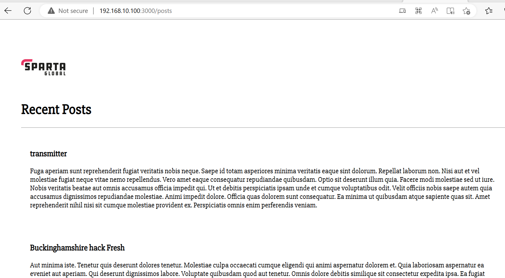

# Multimachine Vagrant
## Setting up two Virtual Machines, app and database, and connecting them

We start by modifying our existing `Vagrantfile`:
```Ruby
Vagrant.configure("2") do |config|
  # Configuration script for app
  config.vm.define "app" do |app|
    app.vm.box = "ubuntu/bionic64"
    app.vm.network "private_network", ip: "192.168.10.100"
    # Sync the app folder
    app.vm.synced_folder "app", "/home/vagrant/app"
    # Provisioning
    app.vm.provision "shell", path: "provision.sh", privileged: false
  end
  # Configuration script for database
  config.vm.define "database" do |database|
    database.vm.box = "ubuntu/bionic64"
    database.vm.network "private_network", ip: "192.168.10.150"
    # Sync the environment folder
    database.vm.synced_folder "environment", "/home/vagrant/environment"
  end
end
```
What we are doing here is we are adding another configuration script for our second VM `database`, the setup of which is similar to our `app` VM. Note that the code should be indented as above.

What we should do next is fire up both VMs by running `vagrant up` in our terminal (in VS Code or directly in Git Bash). We should be able to have both start running with a single command, however if this doesn't happen it is possible to start the VMs by adding the name of the specific VM you want to start to the command.


If any issues arise be sure to check the code in the `Vagrantfile` used to set up these machines and also check the `provision.sh` file used to provision the `app` VM. 
(I had to comment out the lines that started the app and change the version of Node from 6 to 12 to get this working as needed). The shell file should look like this.
```sh
#!/bin/bash

# Update and upgrade
sudo apt-get update -y
sudo apt-get upgrade -y

# Install nginx
sudo apt-get install nginx -y

# Enable or start Nginx
sudo systemctl enable nginx -y

# Install Node.js dependencies
sudo apt-get install python-software-properties -y

# Specifying and Installing the desired version of Node-js (6.x)
curl -sL https://deb.nodesource.com/setup_12.x | sudo -E bash
sudo apt-get install nodejs -y

# Installing pm2 package
sudo npm install pm2 -g
```
Also any previous VM that was running should have been destroyed prior to begining this process.

### Setting up on our database VM
Note that we will require two terminals throughout this process, one where we logged into `app` and the other we use to log into `database`. In one of our terminals we log into `database`:
```command line
vagrant ssh database
```
This particular VM should only have the environment folder. Once we are logged in, we install the database that we want to use. First of all we require a key, we can add this as below:
```command line
sudo apt-key adv --keyserver hkp://keyserver.ubuntu.com:80 --recv D68FA50FEA312927
```
We can verify that this command has worked for us with the following input:
```
echo "deb https://repo.mongodb.org/apt/ubuntu xenial/mongodb-org/3.2 multiverse" | sudo tee /etc/apt/sources.list.d/mongodb-org-3.2.list
```
This should return the output:
```
deb https://repo.mongodb.org/apt/ubuntu xenial/mongodb-org/3.2 multiverse
```
Assuming that everything has gone as above we upgrade and install the system we will use, and we will do so as we did with Nginx
```
sudo apt-get update -y
```
and
```
sudo apt-get upgrade -y
```
Following which we install the actual database, and we do so via the following command:
```
sudo apt-get install -y mongodb-org=3.2.20 mongodb-org-server=3.2.20 mongodb-org-shell=3.2.20 mongodb-org-mongos=3.2.20 mongodb-org-tools=3.2.20
```
After installing the database we need to use the following commands to activate the database:
```
sudo systemctl start mongod
```
and
```
sudo systemctl enable mongod
```
Note its good practice to check everything is alright whilst doing this with the command:
```
sudo systemctl status mongod
```
If everything is ok we should receive the following output after we `enable` our `mongod` database:
```
Created symlink /etc/systemd/system/multi-user.target.wants/mongod.service -> /lib/systemd/system/mongod.service.
```
### Changing the configuration of our database
We want to change the configuration of our database in a way so that our `app` VM will be able to access it.
To do this we need to edit the configuration file `/etc/mongod.conf` using `sudo nano` (sudo may not always be necessary but its better to just use just incase).

What we are looking to change is this block:
```
# network interfaces
net:
  port: 27017
  bindIp: 127.0.0.1
```
In order for our `app` VM to access the database we want to change `bindIp` to `0.0.0.0`, this basically makes it accessible by anything. If unsure about whether this was changed successfully, use `cat` to view the contents of the configuration file.

Once we've made the changes we needed we restart `mongod`.

```
sudo systemctl restart mongod
```
then
```
sudo systemctl enable mongod
```
### Setting up the Environment Variable
Now that we have gone through the set up in our `database` terminal, we now need to move over to the terminal where we logged into the `app` VM and create an environment variable to connect our app to the database.

We set up our environment variable by entering the following
```
export DB_HOST=mongodb://192.168.10.150:27017/posts
```
We can then check that it has been set up properly by the following input
```
printenv DB_HOST
```
Which should return:
```
mongodb://192.168.10.150:27017/posts
```
### Verifying that our app can successfully connect to the database
Now lets `cd` into our `app` folder that's in our VM.
Once we are in the right place we can run the command:
```
npm install
```
To install our app, however in order for us to view the contents of our database, we will need it to be seeded. So in our `app` folder we need to run: 
```
node seeds/seed.js
```
So now if everything has worked properly we can start the actual app:
```
node app.js
```
And get `Your app is ready and listening on port 3000
` in our terminal. So we open our browser and enter the IP Address we used previously (192.168.10.100:3000) to get


And to view the contents of our database we add `/posts` to the end of our IP Address and we should see the following:



And like that, we have created 2 VMs simultaneously and have connected them!