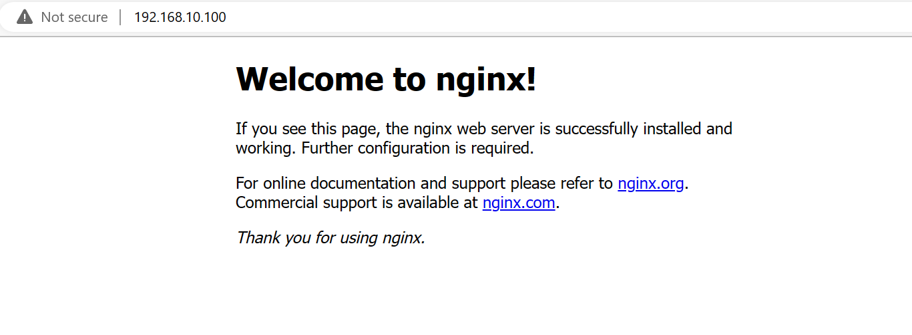

# Provisioning Task 1

#### Writing up a guide to set up our Dev Environment with Provisioning

#### 1. Create a file `provision.sh` in the same directory as our Vagrantfile and enter the following:
```sh
#!/bin/bash

# Update and upgrade
sudo apt-get update -y
sudo apt-get upgrade -y

# Install nginx
sudo apt-get install nginx -y

# Enable or start Nginx
sudo systemctl enable nginx -y
```
These are the commands that we've used to initially set up our Nginx webserver. To ensure that these provisions do run when we setup our VM we add this line to our Vagrantfile.
```Ruby
 config.vm.provision "shell", path: "provision.sh"
```
So our Vagrantfile should look like this
```Ruby
Vagrant.configure("2") do |config|

  config.vm.box = "ubuntu/xenial64"
  config.vm.network "private_network", ip: "192.168.10.100"

  # Sync the app folder
  config.vm.synced_folder "app", "/home/vagrant/app"

  # Provisioning
  config.vm.provision "shell", path: "provision.sh"


end
```
Now we should have everything in place to set up our VM with the provisions as specified in `provision.sh`. So lets fire up our VM and see if our webserver is up.

Once `vagrant up` has finished running with our terminal we can check if our server is up and running on the IP address that we fixed in our Vagrantfile. If all is well our Nginx server should show as it does here



#### 2. Add commands to our shell file to install node.js (version 6) and install pm2.

We start by putting the command to install all dependencies that Node.js requires
```sh
sudo apt-get install python-software-properties -y
```
Once we've done this we can then add 
```sh
curl -sL https://deb.nodesource.com/setup_6.x | sudo -E bash
sudo apt-get install nodejs -y
```
Here we specify the version of Node.js we want to install (which is version 6.x for our app), and then we proceed to install the version of Node.js that we want.

Once Node.js is installed we then want the pm2 package to be installed. In which case we add 
```sh
sudo npm install pm2 -g
```
Now we should be able to ssh into our VM and navigate into our app folder to execute the following command 
```
vagrant@ubuntu-xenial:~/app$ node app.js
```
This command should start up our app and tell us on what port in our IP address we should be able to find the app.

If this works for us as we want we can then look to add provisions into our script to actually start the app.


#### 3. Now that we have provisioned our installation lets provision getting the app started.

We can simply do this by having our VM navigate into our app folder and installing it
```sh
cd app
npm install
```
and then starting the app by adding
```sh
node app.js
```
We can now fire up our VM by using the `vagrant up` command in Bash and we should get


We haven't even had to use ssh to get in and all the steps have been executed, so our app should be up and running just as before!

## Here are snippets of the full code below
### provision.sh


### Vagrantfile

